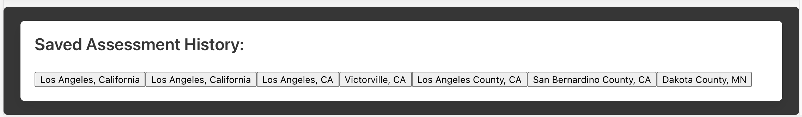

# safe-passage

## Purpose
With over 25 million cases of COVID-19 in the United States, deaths mounting and new variants emerging, the modern traveler is cautious and wants to stay informed. In today’s world, safety remains a top concern for many travelers. Safe Passage addresses this concern by delivering the information needed to assess the risk levels of a region and helps the user plan their trip accordingly. 

Users will find current COVID-19 data for their current location and intended destinations. Also included in the data set is information about: weather, air quality, and demographics, which were identified as factors that could affect risk levels. 

.png)

 

## Built With
* HTML
* JavaScript
* CSS
* Bulma

## Website
https://jaderiver62.github.io/safe-passage
